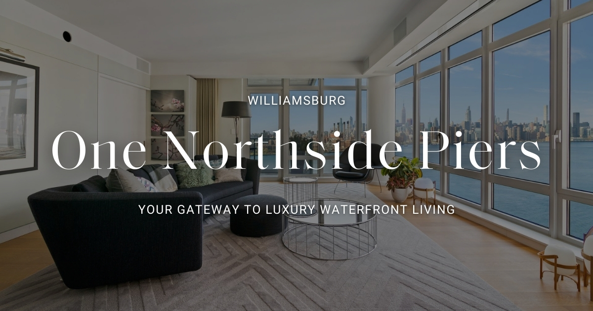

# Luxury Real Estate Showcase

> **A Next.js template designed for quick, elegant real-estate websites, powered by Contentful and Follow Up Boss.**

[View Demo](https://www.onenorthsidepierscondos.com/)



To see more of the front end please visit the [project website](https://emanuele-sgroi.github.io/showcase-gorilla-nft/) or [my portfolio](https://www.emanuelesgroi.com/portfolio/luxury-real-estate-showcase)

## Table of Contents
- [Overview](#overview)
- [Core Features](#core-features)
- [How It Works](#how-it-works)
- [Why This Project?](#why-this-project)
- [How to Use](#how-to-use)
- [Conclusion](#conclusion)
- [License](#license)
- [Contact](#contact)

---

## Overview
This Next.js template lets real estate agents spin up a polished property site for any high-end apartment or condo with minimal effort. It fetches content from **Contentful**, captures leads via **Follow Up Boss**, and accommodates multiple hero types (single image, carousel, or video). By design, it’s small in scope but visually refined, making it easy to replicate for new properties without re-hiring a developer each time.

---

## Core Features

1. **Luxury Aesthetics**  
   - **Tailwind CSS** and **Framer Motion** combine for a high-end look with smooth animations.  
   - Perfect for showcasing upscale condos or apartments.

2. **Contentful Integration**  
   - Each site references a dedicated entry in Contentful.  
   - Property descriptions, photos, amenity details and more, can be edited anytime. No developer required.

3. **Reusable for Multiple Properties**  
   - Spin up a new site by simply pointing to a different Contentful entry and domain.  
   - Saves time and budget for real estate agents managing multiple listings.

4. **Inquiry & Lead Capture**  
   - A dedicated “Inquire” page collects prospective buyer/renter/seller info.  
   - All inquiries are routed to **Follow Up Boss**, automatically updating the agent’s CRM.

---

## How It Works

- **CMS-Filled Content**  
  Each site instance references a unique Contentful entry. Swap images, text, or hero type (video vs. carousel) from the CMS interface.

- **Next.js + Tailwind**  
  Server-side rendering (or static generation) ensures performance. Utility-first styling allows quick visual tweaks.

- **Inquiries → Follow Up Boss**  
  Submitted forms send data directly to the agent’s CRM, centralizing leads under one system.

- **Cloning the Site**  
  Need a new property site? Duplicate this repo, attach it to a new domain, and point the code to another CMS entry. Minimal developer involvement required. You only have to change few things of the json files in the "Administration" folder, but it's done in a 
  very intuitive way even for those who don't know coding

---

## Why This Project?
It started as a single site for a luxury condo in New York. Then the agent wanted another, and another. Instead of building each from scratch, I created a master Next.js template tied to Contentful and integrated with Follow Up Boss. Now, adding a new property page only involves setting up a domain and populating Contentful, drastically reducing costs and development overhead.

---

## How to Use

1. **Setup Environment Variables**  
   Create an `.env` or `.env.local` file containing:
   
   ```
   NEXT_PUBLIC_CONTENTFUL_SPACE_ID=xxxxxxxxxxxxx
   NEXT_PUBLIC_CONTENTFUL_ACCESS_TOKEN=xxxxxxxxxxxxxxxxxxxxxxxxxxxxxxxxxxx
   NEXT_PUBLIC_CONTENTFUL_PREVIEW_TOKEN=xxxxxxxxxxxxxxxxxxxxxxxx
   NODE_ENV="development" # or production
   FUB_API_KEY=xxxxxxxxxxxxxxxxxxxx
   ```
2. **Manual Edits in the Administration Folder**  
- **`./administration/metadata.js`**  
  Configure SEO-related data (page titles, descriptions, Open Graph images). This file ensures consistent branding and social-sharing images across the site.
- **`./administration/siteInfo.js`**  
  Update the domain name and the site’s display name. For example:
  
  ```js
  export const siteInfo = {
    domainName:
      process.env.NODE_ENV === "development"
        ? "http://localhost:3000"
        : "https://example.com",
    nameWebsite: "1 Northside Piers",
  };
  ```

3. **Install and Run**  
- Install dependencies: `npm install`
- Run in dev mode: `npm run dev`
- (Or build and start for production: `npm run build` then `npm run start`)

4. **Customize in Contentful**  
- Adjust text, images, amenity details, hero type (carousel/video/single image).
- Changes appear automatically after a redeploy or via ISR (if configured).

5. **Connect Follow Up Boss**  
- Ensure your `FUB_API_KEY` is correct. The site’s inquiry forms will post leads directly to your CRM.


---

## Conclusion
This approach seamlessly balances a luxury aesthetic with the simplicity needed for rapid duplication. By employing Next.js, Tailwind, and Contentful, real estate agents can deploy new, polished property sites in minutes, complete with inquiry handling and CRM integration. It’s a fast, scalable solution for showcasing any high-end apartment or condo.

---

## License
The core template is offered for anyone to use, provided you credit me as the original developer. Please remove any references specific to client branding or domain configurations if you adapt this for your own projects.

---

## Contact
You can contact me here:
- **Email**: em.sgroi@gmail.com
- **Website**: [emanuelesgroi.com](https://www.emanuelesgroi.com)
